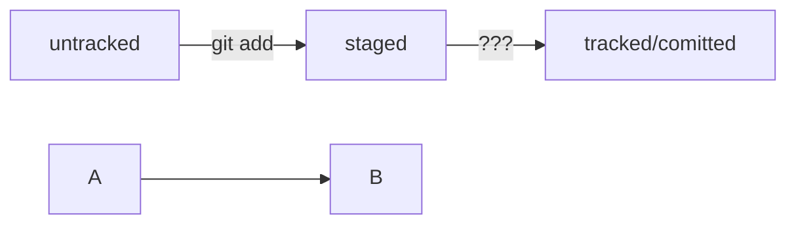

# Типа шпаргалка
[Ссылка на хабр](https://habr.com/ru/companies/ruvds/articles/599929/)
----

## Командная строка
### Просмотр файлов
ls

ls -la *

### Создание файла
touch %имя файла%

### Просмотр файла
cat  %имя файла%

### Удаление директории (рекурсивно (-r) без вопросов (-f))
rm -rf
----
## SSH 
### разные типы шифрования
$ ssh-keygen -t ed25519 -C "электронная почта, к которой привязан ваш аккаунт на GitHub" 

$ ssh-keygen -t rsa -b 4096 -C "электронная почта, к которой привязан ваш аккаунт на GitHub" 
----
## GIT
### Инициализация
git init

### Статус
git status

### Добавление файла
git add %имя файла%
#### Добавление всех файлов в директории
git add .
#### Добавление всех файлов в репозитории
git add --all

### Выполнить коммит
git commit -m "Сообщение"

### История изменений
git log

### Создание новой ветки и переход в неё
git branch -M main

### Подключиться к удалённому репозиторию gitHib
git remote add origin git@github.com:%ИМЯ_АККАУНТА%/%НАЗВАНИЕ_ПРОЕКТА%

### Проверить связку с репозиторием
git remote -v

### Отправить изменения
#### первый запуск
git push -u origin main (master)
#### последующие
git push

### файл HEAD
$ cat HEAD # команда cat показывает содержимое файла
ref: refs/heads/master # в файле ссылка на последний хэш

### Статусы git
#### Проверить статус
git status

untracked (англ. «неотслеживаемый») - файл вне гита
staged (англ. «подготовленный») - файл, подготовленный к коммиту
tracked (англ. «отслеживаемый») - файл в гите
modified (англ. «изменённый») - файл в изменённом состоянии от последнего сохранённого